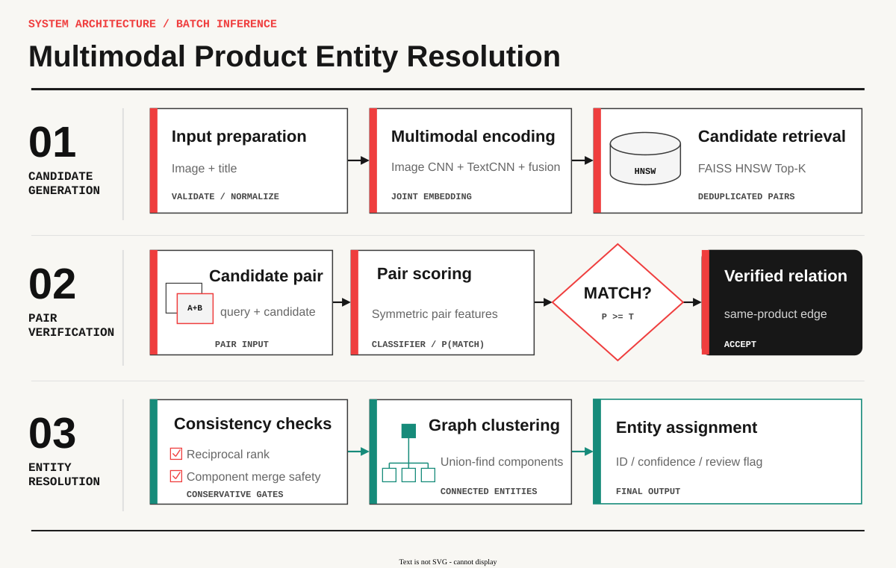

# Multimodal Product Deduplication & Entity Resolution

[](https://github.com/gauronaldo/Shopee-Price-Match-Guarantee-Competition/actions/workflows/ci.yml)


A multimodal retrieval and entity-resolution system for identifying duplicate product listings in
an e-commerce catalog. It combines visual and textual representations with candidate retrieval,
pairwise verification, and conservative graph clustering to recover product identities while
controlling false merges.

Experiments use the Kaggle **Shopee Price Match Guarantee** dataset. Competition data and trained
artifacts remain outside version control in accordance with dataset access and repository hygiene
requirements.

## Project highlights

- Leakage-safe train/validation/test splitting by product group and duplicated visual assets.
- Classical pHash, ORB, character TF-IDF, and late-fusion references alongside custom image,
  text, and multimodal PyTorch models trained from random initialization.
- Train-only hard-negative mining, FAISS HNSW candidate retrieval, calibrated pair scoring, and
  consistency-aware graph clustering.
- Frozen test evaluation across retrieval, pair classification, clustering, calibration, and
  efficiency metrics.
- A comprehensive automated test suite, plus FastAPI, Streamlit, and Docker Compose inference
  paths.

## Problem context

Marketplace catalogs rarely provide a clean one-to-one mapping between listings and physical
products. Multiple sellers can describe the same item using different photos, crops, languages,
abbreviations, packaging, and promotional text. At the same time, products from one brand or
product line may appear nearly identical while differing in model number, size, quantity, color,
or flavor.

The system treats matching as a sequence of related decisions rather than a generic similarity
search:

1. retrieve a high-recall set of plausible duplicate listings;
2. verify exact-product identity using evidence from both modalities;
3. form catalog entities without allowing isolated false-positive edges to trigger large merges.

The exact matching contract and variant policy are documented in
[`docs/problem_definition.md`](docs/problem_definition.md).

## Competition and dataset

The **Shopee Price Match Guarantee** competition was hosted on Kaggle to identify listings that
refer to the same product. For each query listing, participants produced a set of matching
`posting_id` values using the product image, seller-written title, and any representations derived
from them. The challenge reflects a common catalog problem: product identity is not explicitly
shared across sellers, and neither image similarity nor title similarity is reliable on its own.

The competition task is extended into an entity-resolution system with separate candidate
retrieval, pair verification, and graph-clustering stages. This decomposition makes retrieval
misses, pair-scoring errors, and transitive cluster failures independently measurable.

The provided training metadata contains five fields:

| Field | Role |
|---|---|
| `posting_id` | Unique identifier for one seller listing |
| `image` | Filename of the associated product image |
| `image_phash` | Supplied perceptual hash used by the classical image baseline |
| `title` | Noisy, multilingual seller-written product description |
| `label_group` | Competition ground-truth product group, used only offline |

| Dataset property | Observed value |
|---|---:|
| Listings | 34,250 |
| Product groups | 11,014 |
| Unique referenced images | 32,412 |
| Median / maximum group size | 2 / 51 |
| Median image dimensions | 700 × 700 px |
| Median title length | 53 characters |

The downloadable competition test set contains only three placeholder listings because the actual
competition test labels were hidden by Kaggle. For leakage-controlled experimentation, this project
creates its own deterministic split from the labeled training release:

| Split | Listings | Product groups |
|---|---:|---:|
| Train | 27,391 | 8,817 |
| Validation | 3,430 | 1,100 |
| Test | 3,429 | 1,097 |

Splitting is performed by `label_group` and by super-components connected through exact image
references, image hashes, or perceptual hashes. As a result, the same labeled product group or
exact duplicated visual asset cannot appear in more than one split. Vocabulary construction,
checkpoint selection, thresholds, retrieval settings, and clustering rules use train and
validation only. Aggregate statistics and known label ambiguities are documented in the
[`data card`](docs/data_card.md) and
[`data quality report`](reports/data_quality_and_split.md).

## System overview

[](assets/diagrams/shopee_entity_resolution_swiss_grid_large.drawio.svg)

The image encoder, text encoder, fusion module, losses, sampling logic, training loops, pair head,
retrieval evaluation, and clustering policy are implemented in this repository. The core neural
track is trained from random initialization; pretrained EfficientNet-B1 is evaluated later as a
separate benchmark under the same retrieval protocol.

Ground-truth `label_group` is used only for offline splitting, training, evaluation, and analysis.
It is not loaded into the demo inference contract. See
[`docs/architecture.md`](docs/architecture.md) for the training, batch, and online flows.

## Results

The held-out system evaluation was run once after checkpoints, thresholds, candidate K, and graph
rules were frozen on validation.

### Frozen held-out performance

| Stage | Metric | Held-out test |
|---|---|---:|
| End-to-end | Mean sample-wise F1 | **0.79591** |
| Retrieval | mAP@20 | 0.89245 |
| Retrieval | Recall@20 | 0.95371 |
| Clustering | Pairwise precision / recall / F1 | 0.87850 / 0.40396 / 0.55344 |
| Clustering | B-cubed F1 | 0.84711 |
| Failure analysis | False-split group rate | 0.28350 |

Mean sample-wise F1 computes one match-set F1 value per listing, including the listing itself, and
then averages across the held-out split. The selected system combines frozen dense candidates,
train-fitted character TF-IDF, and pHash
with weighted reciprocal-rank fusion. Supported singleton attachment then recovers isolated
listings only when at least two members of one established component agree. The trained
multimodal checkpoint and pair head remain frozen; the retrieval and graph stages define the final
inference policy.

The operating point was selected on validation and evaluated without test-time adjustment.
Because earlier component experiments had already used the same split, this is reported as a
confirmatory frozen evaluation rather than as a globally unseen test.

Full metrics, efficiency measurements, ablations, repeated seeds, and failure analyses are indexed
in [`reports/README.md`](reports/README.md). The final frozen result is in
[`reports/final_evaluation.md`](reports/final_evaluation.md).

## Installation and data

```powershell
python -m venv .venv
.venv\Scripts\python -m pip install --upgrade pip
.venv\Scripts\python -m pip install -e ".[dev,eda,retrieval,pretrained,demo]"
```

### Quick repository verification

A reviewer can validate the installation without Kaggle access or trained artifacts. The smoke
command uses the committed synthetic fixture rather than competition records:

```powershell
.venv\Scripts\python -m pytest
.venv\Scripts\shopee-smoke --config configs\smoke.yaml
```

The demo does not require model training. Frozen inference checkpoints are distributed separately
from Git, while each user supplies the competition data under Kaggle's access terms. A bootstrap
command then recreates the catalog embeddings, retrieval index, and entity assignments locally.

Expected local-only Kaggle layout:

```text
data/raw/
  train.csv
  train_images/
  test.csv
  test_images/
  sample_submission.csv
```

The Kaggle public test directory contains only three placeholder examples. This project creates a
deterministic group-disjoint train/validation/test split from `train.csv` so that each
`label_group` occurs in exactly one split. Vocabulary, thresholds, retrieval settings, and graph
rules are selected without test leakage.

```powershell
.venv\Scripts\shopee-data prepare --config configs\data\shopee.yaml
```

The source CSV checksum and schema are verified before processing. Raw data, generated manifests,
checkpoints, indexes, caches, and detailed review artifacts are ignored by Git.

### Full-demo artifacts

The `v1.0.0` model release is designed as a separate GitHub Release asset named
`shopee_demo_models_v1.0.0.zip` (SHA-256
`48ce1deb2aac264fa1586ce6093b41713830f30ea3c20349c7122a037de41cce`). The archive contains the
four frozen inference checkpoints and the lightweight records required to verify them. It contains
no Shopee images, titles, labels, catalog embeddings, or entity assignments.

The complete file-level contract is versioned in
[`configs/serving/model_release.yaml`](configs/serving/model_release.yaml). The installer verifies
the archive and every extracted file before making them available to the application. If the
Release asset has not yet been published, the project owner can build the identical ZIP with
`shopee-demo package-models`; publishing remains a separate version-control/release action.

After accepting the competition rules, download and extract the Kaggle files into `data/raw/`, then
run:

```powershell
.venv\Scripts\shopee-demo download-models
.venv\Scripts\shopee-demo bootstrap --device auto
.venv\Scripts\shopee-demo preflight
.venv\Scripts\shopee-demo launch
```

`download-models` restores the released weights. `bootstrap` validates the dataset, reproduces the
frozen group-disjoint validation catalog, extracts embeddings, builds candidate retrieval, and
creates entity assignments. It performs inference only: it does not execute a training loop or
access the held-out project test split.

## Reproducing the pipeline

The table shows the canonical command for each system function. Completed experiment outputs are
immutable by design; use a new artifact root for a deliberate rerun instead of overwriting evidence.

| Function | Command |
|---|---|
| Smoke test | `.venv\Scripts\shopee-smoke --config configs\smoke.yaml` |
| Data audit and split | `.venv\Scripts\shopee-data prepare --config configs\data\shopee.yaml` |
| Classical baselines | `.venv\Scripts\shopee-benchmark run --config configs\experiment\classical_retrieval_benchmark.yaml` |
| Custom image training | `.venv\Scripts\shopee-image train --config configs\experiment\image_embedding_training.yaml` |
| Custom text training | `.venv\Scripts\shopee-text train --config configs\experiment\text_embedding_training.yaml` |
| Multimodal cache preparation | `.venv\Scripts\shopee-multimodal prepare --config configs\experiment\multimodal_embedding_training.yaml` |
| Multimodal training | `.venv\Scripts\shopee-multimodal train --config configs\experiment\multimodal_embedding_training.yaml` |
| Hard-negative training | `.venv\Scripts\shopee-hard-negatives all --config configs\experiment\hard_negative_pair_head_pilot.yaml` |
| Candidate retrieval | `.venv\Scripts\shopee-retrieval benchmark --config configs\experiment\candidate_retrieval_benchmark.yaml` |
| Entity resolution | `.venv\Scripts\shopee-entity-resolution benchmark --config configs\experiment\entity_resolution_benchmark.yaml` |
| Recall-recovery graph | `.venv\Scripts\shopee-entity-resolution recover-recall --config configs\experiment\entity_recall_recovery.yaml` |
| Hybrid candidate retrieval | `.venv\Scripts\shopee-retrieval hybrid --config configs\experiment\hybrid_candidate_retrieval.yaml` |
| Hybrid entity evaluation | `.venv\Scripts\shopee-entity-resolution evaluate-hybrid-candidates --config configs\experiment\hybrid_entity_resolution.yaml` |
| Pretrained weight preparation | `.venv\Scripts\shopee-pretrained prepare-weights` |
| Pretrained comparison | `.venv\Scripts\shopee-pretrained benchmark --config configs\experiment\pretrained_image_benchmark.yaml` |
| Frozen system preflight | `.venv\Scripts\shopee-final preflight-hybrid --config configs\experiment\hybrid_system_evaluation.yaml` |

An access marker protects the single-use final test protocol. Run preflight before a fresh frozen
evaluation; after the access marker or outputs exist, it intentionally blocks a second test run.

The sequence from data preparation through entity resolution produces the components needed for an
independently rebuilt demo. The hybrid retrieval and final-system rows reproduce the selected batch
evaluation but are not required by the validation-catalog UI. The committed
`configs/serving/demo.yaml` remains the immutable contract for the original frozen artifacts.

## Demo

The demo supports image-only, title-only, and multimodal queries; guided scenarios; open-ended
uploads; query-versus-candidate comparison; modality evidence; self-match exclusion; and explicit
no-match or manual-review states. It searches the frozen validation catalog rather than the
held-out test split.

Literal UTF-8 byte escapes found in some source titles, for example `\xe2\x9c\x85`, are decoded
only for presentation. The frozen text encoder still receives the original title representation
used during training.

### Local launcher

After `download-models` and `bootstrap` complete, verify the generated serving contract and start
both services:

```powershell
.venv\Scripts\python -m shopee_match.serving.cli preflight
.venv\Scripts\python -m shopee_match.serving.cli launch
```

Open:

- Streamlit UI: `http://127.0.0.1:8501`
- FastAPI/OpenAPI: `http://127.0.0.1:8000/docs`
- Health endpoint: `http://127.0.0.1:8000/health`

Press `Ctrl+C` once in the launcher terminal to stop both services.

### Docker Compose

Docker packages the application environment but does not redistribute the licensed dataset.
Run `download-models` and `bootstrap` on the host first; Compose then mounts the resulting `data/`
and `artifacts/` directories read-only.

Start Docker Desktop with the Linux container engine, then run:

```powershell
docker compose config
docker compose up --build
```

After both services become healthy, open `http://localhost:8501`. Stop them with:

```powershell
docker compose down
```

The Compose profile defaults to CPU inference. GPU containers require NVIDIA Container Toolkit
and an explicit device configuration. Runtime behavior and API contracts are documented in
[`docs/demo.md`](docs/demo.md).

## Engineering quality

```powershell
.venv\Scripts\python -m ruff format --check .
.venv\Scripts\python -m ruff check .
.venv\Scripts\python -m mypy src\shopee_match
.venv\Scripts\python -m pytest
```

The test suite covers leakage-safe splitting, title normalization, image preprocessing, sampling,
losses, encoder shapes and gradients, exact/FAISS agreement, clustering, frozen evaluation guards,
API contracts, guided self-exclusion, and the combined launcher.

## Repository structure

```text
app/                         Streamlit demo UI
configs/                     Data, model, experiment, and serving contracts
data/                        Ignored raw/derived data and local split manifests
docs/                        Problem definition, architecture, cards, and limitations
notebooks/exploration/       Bounded EDA notebook
reports/                     Reviewed metrics and failure-analysis evidence
src/shopee_match/
  data/                      Ingestion, audit, and group-disjoint splitting
  features/ models/ losses/  Classical features and custom neural components
  training/ retrieval/       Training, mining, and candidate generation
  clustering/ evaluation/    Entity resolution and controlled evaluation
  serving/                   Frozen runtime, FastAPI, and launcher
tests/                       Synthetic fixtures, unit tests, and integration tests
```

## Documentation

- [Problem definition](docs/problem_definition.md)
- [Architecture](docs/architecture.md)
- [Data card](docs/data_card.md)
- [Model card](docs/model_card.md)
- [Error analysis](docs/error_analysis.md)
- [Demo and API](docs/demo.md)
- [Experiment reports](reports/README.md)

## Limitations

- The dataset contains noisy labels, multilingual seller text, malformed byte escapes, and
  ambiguous product variants.
- The strict clustering policy limits false merges but fragments many large product groups.
- Reported latency covers a 3,430-listing validation catalog; production-scale behavior requires
  measurement on a substantially larger index and representative request load.
- The demo searches a fixed validation catalog and omits persistent ingestion, authentication,
  rate limiting, monitoring, and artifact distribution.
- Competition data remains subject to Kaggle/Shopee access and redistribution terms.
