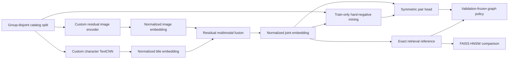
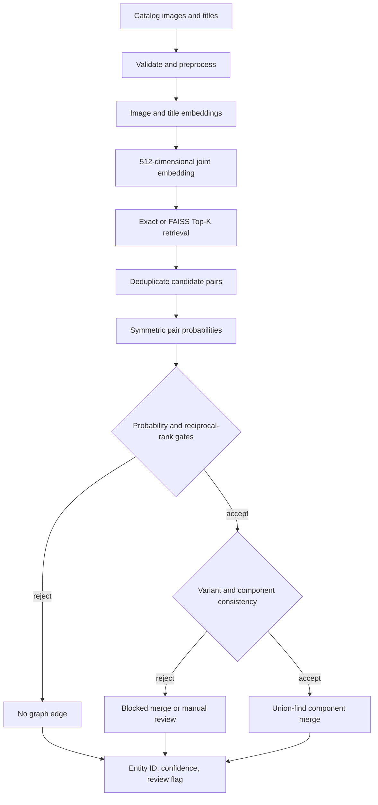

# System Architecture

## Training and evidence flow

The image and text encoders are trained from random initialization. Fusion starts only after both
unimodal checkpoints are frozen. Hard-negative mining changes the pair head without changing the
joint retrieval embedding. Validation selects checkpoints and operating rules; test is descriptive
only.

## Batch entity-resolution flow

Candidate retrieval controls recall: missing candidates cannot be recovered downstream. Pair
scoring controls local match evidence. Graph consistency controls entity-level risk because one
false-positive edge can transitively merge otherwise correct groups.

## Online evidence contract

For one query listing, the same encoders produce a joint embedding, retrieve Top-K catalog
candidates, and score candidate pairs. The response should expose candidate IDs, total confidence,
image/title similarity evidence, predicted entity or no-confident-match state, and a manual-review
flag. No deployment claim is made until the final demo is independently tested.
