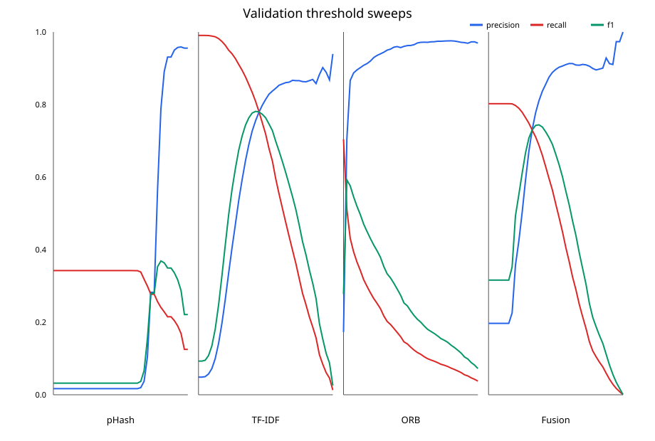

# Classical retrieval benchmark

This report contains aggregate validation/test results only. Retrieval uses the full
corresponding split as its candidate pool and always excludes the query itself.
TF-IDF vocabulary and IDF are fit on train only. Fusion weight and pair
thresholds are selected on validation, then frozen for the final test evaluation.

## Provenance

- Config: `classical_retrieval.benchmark.v1` (`44a8013af994aa8b16b7bb408457bf514468552f9e7bce8f9eb9d37a7a22ac3e`)
- Split manifest SHA-256: `c9cef390b5fbde6c833fddb15a0a8df2c7fbecacd8d50fb83aadba6056bf8e09`
- Git commit / dirty: `b98f4ab4721cbcb505cbeaeacd8f1c69ef4bf731` / `True`
- Seed: `2026`
- Environment: Python `3.12.13`, OpenCV `4.12.0`, NumPy `2.2.6`, scikit-learn `1.9.0`

## Results

Retrieval metrics are macro-averaged per query. Pair F1 is micro-averaged over directed pairs and counts unretrieved positives as false negatives. Retrieval columns use K=20.

| Baseline | Val mAP | Val recall | Val threshold | Test mAP | Test recall | Test pair F1 | End-to-end runtime (s) |
|---|---:|---:|---:|---:|---:|---:|---:|
| phash | 0.2895 | 0.3174 | 0.8125 | 0.3073 | 0.3345 | 0.3607 | 9.42 |
| tfidf | 0.8635 | 0.9385 | 0.4269 | 0.8564 | 0.9291 | 0.7048 | 76.48 |
| orb | 0.6638 | 0.8284 | 0.0280 | 0.6577 | 0.8151 | 0.5766 | 425.44 |
| fusion | 0.8790 | 0.9411 | 0.3687 | 0.8810 | 0.9349 | 0.7220 | 89.71 |
| pair_matcher | 0.9132 | 0.9535 | 0.5674 | 0.9004 | 0.9467 | 0.7416 | 497.85 |

Selected fusion text weight: **0.75**.
Fusion improves test mAP@20 over TF-IDF by **0.0246**.
The pair matcher changes test pair F1 versus weighted fusion by **+0.0196**.
Runtime covers validation plus test; ORB and fusion include their candidate stages.
Mean end-to-end milliseconds/query: phash=1.37, tfidf=11.15, orb=62.03, fusion=13.08, pair_matcher=72.58.
Peak process working set: **1118.7 MiB**.

## Candidate ceiling

The label-blind union contains the top candidates from pHash and TF-IDF before ORB
or pair scoring. Its full-set recall is the maximum any downstream scorer can retain.

| Split | Macro positive recall | Hit rate | Mean candidates/query | Max candidates |
|---|---:|---:|---:|---:|
| Validation | 0.9584 | 0.9910 | 38.59 | 40 |
| Test | 0.9512 | 0.9866 | 38.61 | 40 |

## Pair matcher coefficients

Coefficients operate on standardized features. Positive values support a match;
negative values oppose one. Magnitude indicates influence within this fitted model,
not causality.

| Feature | Standardized coefficient |
|---|---:|
| `orb_similarity` | +1.6108 |
| `tfidf_similarity` | +1.0211 |
| `quantity_conflict` | -0.5134 |
| `token_jaccard` | +0.4991 |
| `phash_similarity` | -0.2789 |
| `digit_conflict` | -0.1952 |
| `digit_jaccard` | +0.1547 |
| `model_token_jaccard` | -0.0989 |
| `title_length_ratio` | -0.0847 |
| `quantity_overlap` | +0.0785 |
| `exact_normalized_title` | -0.0587 |

## Structured pair-matcher failures

Counts use directed test pairs at the validation-selected threshold. Bounded examples
with local titles and IDs remain in the ignored artifact directory.

| Failure category | Count |
|---|---:|
| `retrieval_miss` | 3,773 |
| `false_positive:other_pair_error` | 1,580 |
| `false_negative:other_pair_error` | 1,272 |
| `false_negative:digit_or_model_conflict` | 521 |
| `false_positive:digit_or_model_conflict` | 385 |
| `false_positive:text_dominant_modality_disagreement` | 364 |
| `false_negative:quantity_or_unit_conflict` | 89 |
| `false_positive:exact_phash_cross_label` | 46 |
| `false_negative:image_dominant_modality_disagreement` | 18 |
| `false_positive:quantity_or_unit_conflict` | 16 |
| `false_positive:exact_title_cross_label` | 4 |
| `false_positive:image_dominant_modality_disagreement` | 4 |

## Sampled failure analysis

Manual review of the ignored deterministic example file found semantically unrelated
pHash neighbors, title matches that omit identity-critical model/variant details, and
ORB matches driven by shared visual structure. Several high-scoring cross-label title
pairs also look plausibly identical, consistent with the Phase 1 label-fragmentation
warning. These cases remain evaluation errors; labels are not silently rewritten.

## Interpretation guardrails

- The supplied pHash is an image-appearance signal, not proof of product identity.
- ORB reranks the label-blind union of pHash and TF-IDF candidates; its
  retrieval ceiling is therefore limited by that candidate union.
- Pair features are label-blind. Logistic Regression is fitted on train pairs only;
  the decision threshold is selected on validation and frozen for test.
- Test labels were used only after validation selected the fusion weight and
  thresholds.
- Local success/failure examples are saved under the ignored artifact directory for
  manual review and are not redistributed.
