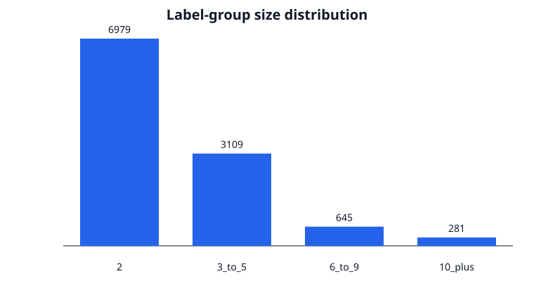
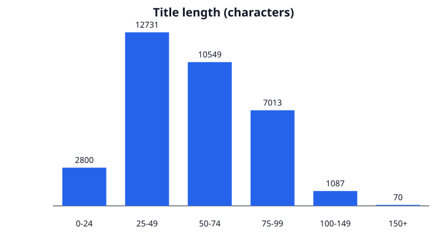
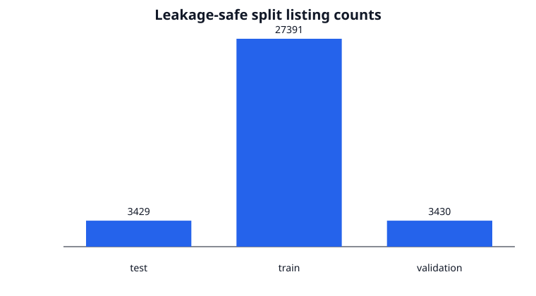

# Shopee data audit v1

This report is generated from aggregate statistics only. Raw Kaggle CSVs and images remain local.

## Provenance

- Config: `phase1.data.v1` (`6bf0e4b85084c03bbedf807fe17aec808b08b6d3ecc8f6b803a4ae9e91852093`)
- Train CSV SHA-256: `82b8ec57e81b603e00c63779b7eeea69a2bd7d9cbb48377657cf547b422f9175`
- OpenCV: `4.12.0`
- Split strategy: `leakage_super_component.v1`, seed `2026`
- Manifest SHA-256: `c9cef390b5fbde6c833fddb15a0a8df2c7fbecacd8d50fb83aadba6056bf8e09`

## Dataset

- Listings: **34,250**
- Label groups: **11,014**
- Unique referenced images: **32,412**
- Missing values / duplicate IDs / decode failures: **0 / 0 / 0**
- Group size median / P95 / max: **2 / 7 / 51**
- Title length median / P95: **53 / 98** characters

## Leakage-safe split

- Listings: `{"test": 3429, "train": 27391, "validation": 3430}`
- Label groups: `{"test": 1097, "train": 8817, "validation": 1100}`
- Super-components: **10,866**
- Multi-label components: **129**
- Maximum component: **4 labels / 69 rows**
- Integrity checks: `{"exact_phashes_cross_split": 0, "image_references_cross_split": 0, "label_groups_cross_split": 0, "sha256_cross_split": 0}`
- Near-pHash pairs crossing splits: **77**. They are audited but not automatically merged because
  some are valid variants.

## Findings

| Code | Severity | Count | Meaning |
|---|---:|---:|---|
| `exact_image_cross_label` | warning | 46 | Exact image reference spans labels |
| `exact_sha_cross_label` | warning | 46 | Exact image bytes span labels |
| `exact_phash_cross_label` | warning | 147 | Exact pHash spans labels |
| `near_phash_cross_label` | warning | 327 | Cross-label pHash pairs have Hamming distance <= 4 |
| `normalized_title_cross_label` | warning | 106 | Normalized title spans labels |

## Manual inspection

A deterministic local gallery with 24 same-group and 24 difficult cross-group pairs is generated
under the ignored inspection directory. Spot checks found both probable fragmented labels and
legitimate product variants (for example, 470 ml versus 780 ml packaging). This supports retaining
the source labels while treating pHash/title collisions as audit and hard-negative signals.
